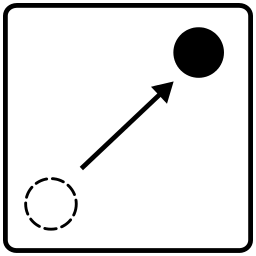
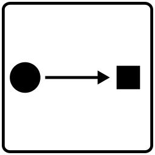
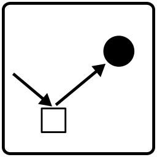
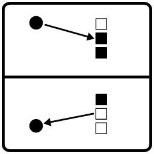
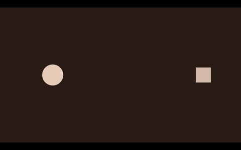
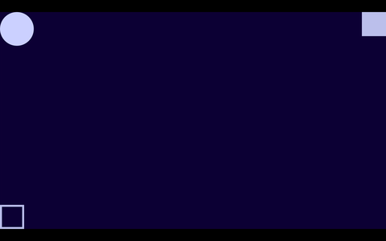
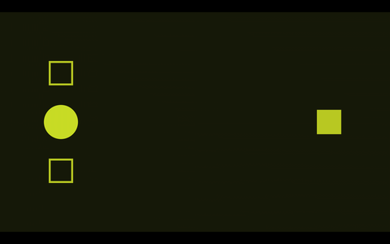
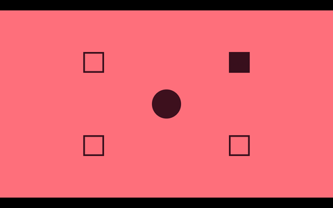
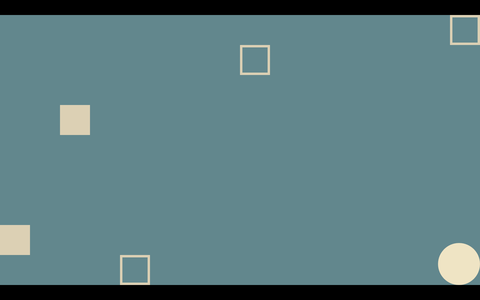

# 
Orb is a musical 2d puzzle game, designed primarily for Android devices. 

## Rules
### 1. Propel
Propel the Orb (the circle) and move it around. This is done by poking the
Orb in the direction you want it to go. If you poke too quickly, Orb will
run out of oxygen and you will have to wait for to reinflate before propelling
again.

### 2. Collide
Collide into squares in the space. 

### 3. Turn off
Turn off any "on" squares (filled in squares) by colliding into them. This
will change them into the "off" state (stroked squares). 

### 4. Toggle
Any time a square gets turned off, it can toggle the state of other 
squares, on to off, and off to on. The rules for these are determined for
each level.

When all the squares have been turned off, you will ascend to the next level.
And so on, and so forth...

## Sound and Music

The soundtrack to Orb is synthesized entirely in realtime.  There are no
audio files used. The synthesis is done using
[Soundpipe](https://pbat.ch/proj/soundpipe.html). The audio components conist of the following:

- 3 FM oscillators, used as background drone music
- Enveloped filtered noise generator used for propulsion sounds
- Modal synthesis used as a simple physical model for collisions
- Feedback echo delay
- Modified FDN Reverb, optimized for Android mobile devices

## Graphics

The graphics are done using [NanoVG](https://github.com/memononen/nanovg),
a small anti-aliased 2d vector graphics library built on top of OpenGL. 

## Installing
Right now, Orb must be compiled from
[source](http://git.sr.ht/~pbatch/orb).

## Screenshots

## demo

Currently hosted on [youtube](https://www.youtube.com/embed/Q3QjTMByalk).

{{FOOTER}}
